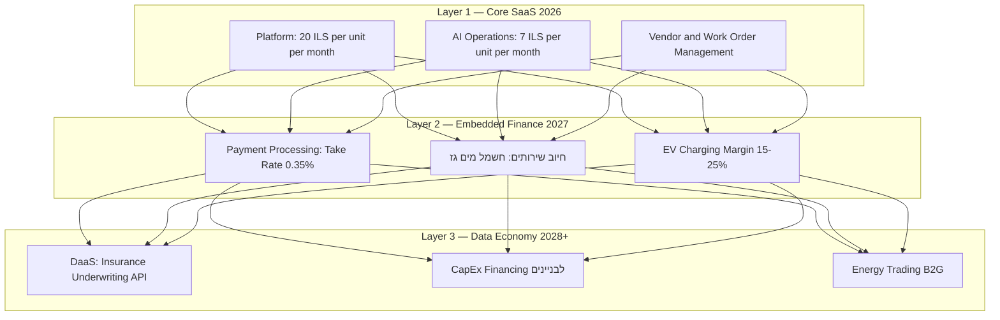
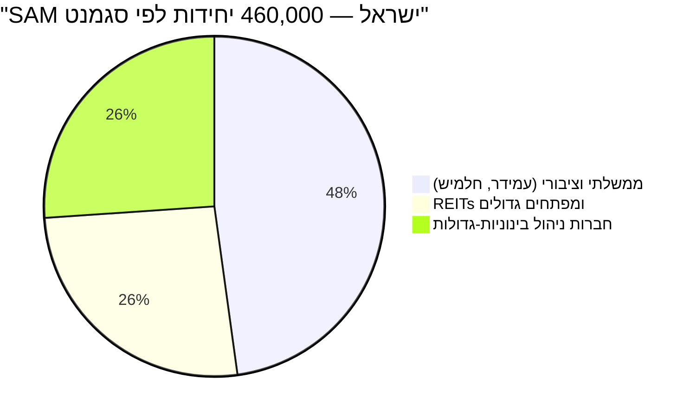
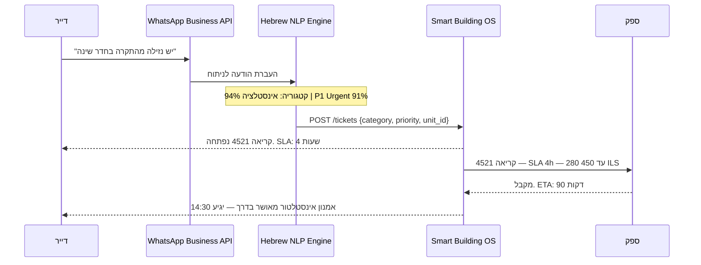
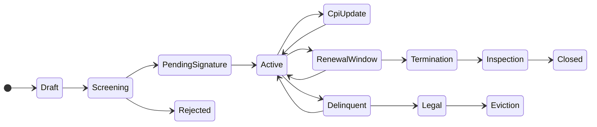
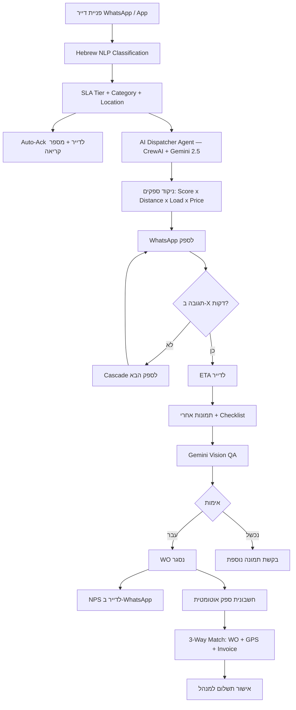
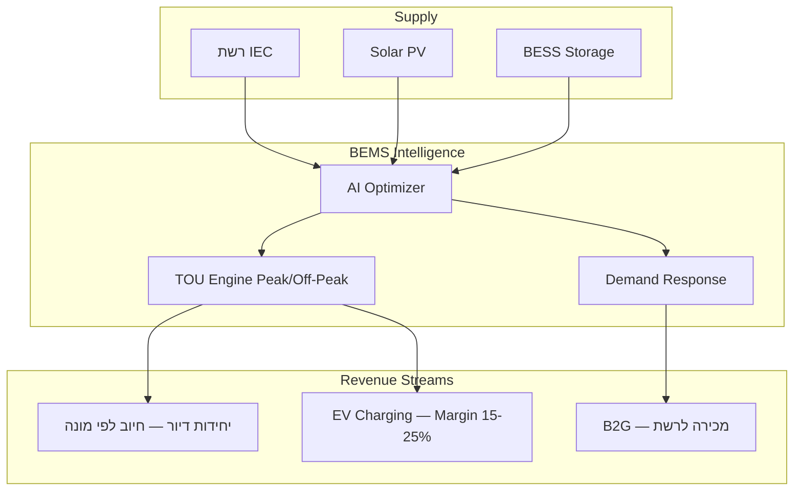
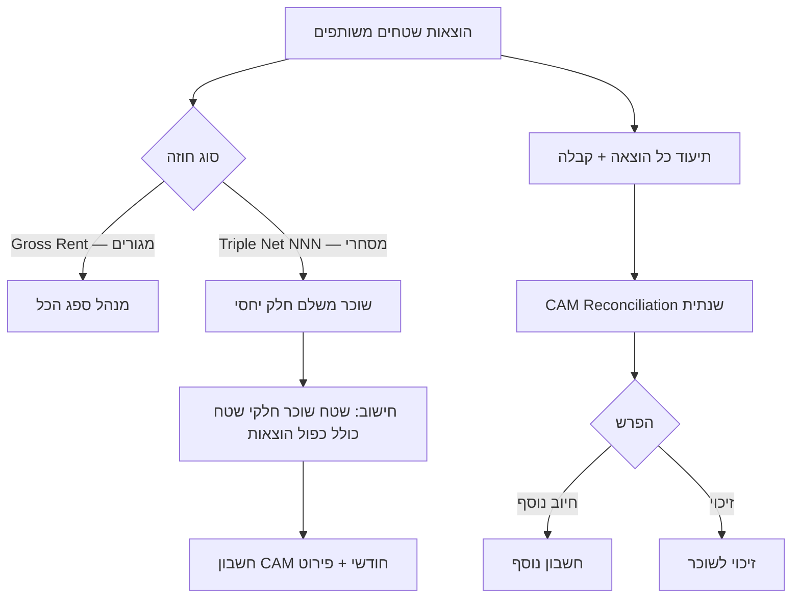
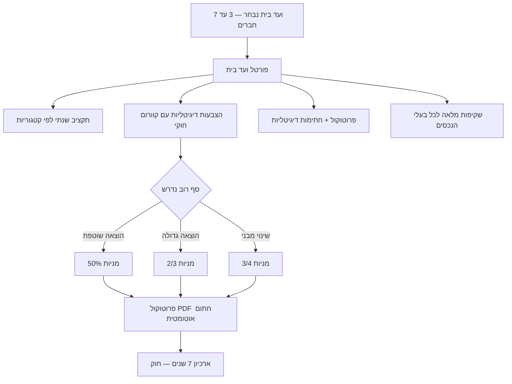
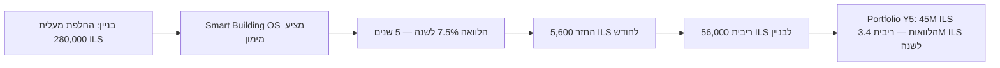

<div dir="rtl">

# SMART BUILDING OS — Master PRD
## Blueprint אסטרטגי ומסמך דרישות מוצר | גרסה 3.0 | יולי 2026

> **חזון:** Smart Building OS היא הפלטפורמה הראשונה שהופכת בניין מגורים מנכס פאסיבי לגוף עסקי פעיל — כזה שמייצר הכנסה מאנרגיה, מנתונים ומשירותים פיננסיים, ומנהל את עצמו ברובו בבינה מלאכותית.

---

## 01 · תקציר מנהלים — הטיעון ל-VC

ניהול נכסים בישראל כיום נשען על שבע מערכות לא מחוברות. חברות ניהול גדולות מאבדות **₪4,200–₪12,000 לשנה לכל יחידת דיור**. **אף מערכת** לא מציעה: הצמדה למדד אוטומטית, מסב, WhatsApp NLP, וועד בית דיגיטלי — כל ארבעה בפלטפורמה אחת.

### שלוש שכבות ערך



### KPIs מרכזיים

| מדד | ערך | Benchmark |
|---|---|---|
| ARR שנה 3 (2028) | **$19.8M** | — |
| ARR שנה 5 (2030) | **$64.0M** | — |
| NRR Target שנה 3 | **122%** | Best-in-class ≥120% ✓ |
| Gross Margin | **63–67%** | AppFolio Actual: 63.7% ✓ |
| ARPU שנה 5 | **₪43.30/יחידה/חודש** | AppFolio Blended: ₪31.2 |
| LTV:CAC Target | **≥7:1** | Series A Standard ✓ |

---

## 02 · ניתוח שוק: TAM · SAM · SOM

| מדד | נתון (2024) | מקור |
|---|---|---|
| מלאי דיור כולל | ~3.0M יחידות | CBS |
| שוק השכירות | ~960,000 יחידות (32%) | CBS / אמדן |
| מנוהל מקצועית כיום | ~240,000 יחידות (25%) | **ההזדמנות הישירה** |
| שכ"ד ממוצע | ₪5,800–₪7,200/חודש | ממוצע ארצי |
| SAM — חברות ניהול מוסדיות | 79 חברות · 460,000 יחידות | ניתוח |
| ARR פוטנציאל SAM מלא | **₪177M ≈ $48M** | ניתוח |



| שוק | הגדרה | ARR פוטנציאל |
|---|---|---|
| **TAM** ישראל | כל ניהול הנכסים הפוטנציאלי | $55M |
| **SAM** | חברות 1,000+ יחידות | $48M |
| **SOM** שנה 3 | 8–12% מה-SAM | **$7.9M** |
| **TAM** אזורי (Y5+) | טורקיה · דרום אירופה · מפרץ | $600M+ |

### Regulatory Tailwinds

- **2024:** תיקון חוק הבתים המשותפים — דיגיטליזציה חובה לדוחות ועד בית
- **2025:** תקנות EV (החלטת ממשלה 4961) — תשתית חובה בכל בניין חדש
- **2026:** דרישות GRESB מקרנות הגמל והפנסיה הישראליות
- **2027:** רגולציית AMI — מדידה חכמה חובה לבניינים מעל 6 יחידות

---

## 03 · ארכיטקטורת המרחב — Digital Twin היררכי

```mermaid
graph TD
    MEGA[MEGA-SITE — מתחם עירוני משולב]
    MEGA --> RES[Residential Tower — 150 יחידות]
    MEGA --> COM[Commercial Block — 8000 מ"ר]
    MEGA --> SHARED[Shared Amenities]
    RES --> FLOOR[Floor / Wing]
    FLOOR --> UNIT[Residential Unit]
    UNIT --> ASSET_U[Unit Asset — מזגן / דוד]
    ASSET_U --> IOT_S[IoT Sensor — טמפ' / רטיבות]
    SHARED --> PARKING[Parking + EV]
    SHARED --> MECH[Mechanical Room]
    PARKING --> EV[EV Charger OCPP 2.0.1]
    MECH --> SMART_METER[Smart Meter AMI]
```

```mermaid
erDiagram
    BUILDING { uuid id PK; string name; jsonb energy_targets }
    FLOOR { uuid id PK; uuid building_id FK; int number }
    UNIT { uuid id PK; uuid floor_id FK; string type; float sqm }
    ASSET { uuid id PK; uuid unit_id FK; string category; jsonb hardware_meta; date next_pm_date }
    LEASE { uuid id PK; uuid unit_id FK; date start_date; date end_date; decimal base_rent; string cpi_index }
    BUILDING ||--o{ FLOOR : contains
    FLOOR ||--o{ UNIT : contains
    UNIT ||--o{ ASSET : has
    UNIT ||--o| LEASE : subject_to
```

---

## 04 · חוויית הדייר: WhatsApp NLP ופורטל



| מדד | ביצוע | Benchmark שוק |
|---|---|---|
| דיוק סיווג קטגוריה | 91–94% | 75–82% |
| דיוק הערכת דחיפות | 87–91% | 72–79% |
| False Positive חירום | <2% | <5% |
| שפות נתמכות | עברית · רוסית · ערבית · אנגלית | — |
| Latency P99 | <800ms | — |

**NPS Target:** ≥55 בשנה 2 (ממוצע ישראלי כיום: 10–25)

---

## 05 · Command Center למנהל הנכס

### Portfolio Dashboard — ארבעה ריבועי KPI

```
תפוסה: 94.2%  |  קריאות פתוחות: 47  |  Pipeline חוזים: 8 פגי-תוקף  |  חייבים >60 יום: 5
```

### Lease Lifecycle



---

## 06 · רשת הספקים — Vendor Management 2.0

```mermaid
flowchart TD
    A[הזמנה ב-WhatsApp לספק] --> B[הרשמה לפורטל]
    B --> C[פרופיל + מחירון + אזורים]
    C --> D{מסמכים חובה}
    D --> D1[ח.פ. / עוסק מורשה]
    D --> D2[רישיון מקצועי]
    D --> D3[ביטוח אחריות 5M ILS]
    D --> D4[ביטוח תאונות עבודה]
    D --> D5[אישור ניכוי מס]
    D --> D6[חשבון בנק מאומת]
    D1 -->|API רשם החברות| V1{ח.פ. פעיל?}
    D5 -->|API שע"מ| V2{ניכוי מס תקף?}
    D3 -->|OCR + AI| V3{סכום ותוקף?}
    V1 & V2 & V3 -->|הכל עבר| Trial[3 Work Orders ניסיון]
    Trial --> ScoreCheck{ציון 3.5 מתוך 5?}
    ScoreCheck -->|כן| Approved[ספק מאושר — גישה מלאה]
    ScoreCheck -->|לא| Offboard[סיום שיתוף]
```

| ממד | משקל | מה נמדד |
|---|---|---|
| מהירות | 30% | זמן תגובה · ETA accuracy |
| איכות | 35% | First-Time-Fix Rate · NPS |
| מחיר | 25% | עמידה במחירון |
| מעורבות | 10% | שימוש ב-App · תיעוד |

---

## 07 · Agentic CMMS: AI Dispatch + Gemini Vision

### מטריצת SLA

| Level | שם | תגובה | פתרון | קנס לספק |
|---|---|---|---|---|
| **P0** | חירום | 15 דקות | 4 שעות | ₪2,000 |
| **P1** | דחוף | 2 שעות | 24 שעות | ₪500 |
| **P2** | שוטף | 8 שעות | 72 שעות | ₪100 |
| **P3** | מתוכנן | 24 שעות | 14 ימים | — |

### AI Dispatch → Gemini Vision → 3-Way Match



---

## 08 · תחזוקה מונעת ו-Predictive Maintenance AI

### לוח ציות ישראלי

| מערכת | תדירות | רגולטור | סיכון אי-ציות |
|---|---|---|---|
| **מעלית** | כל 6 חודשים | משרד הכלכלה | עצירת מעלית + קנס |
| **גנרטור** | חודשי + שנתי | SI | ביטוח לא יכסה |
| **כיבוי אש** | שנתי | כיבאות והצלה | ביטול היתר אכלוס |
| **מיכל מים** | שנתי | משרד הבריאות | סכנה בריאותית |
| **חשמל** | כל שנתיים | חשמלאי מוסמך | חשיפה פלילית |

### Predictive Maintenance — ROI מוכח

| מערכת | דיוק חיזוי | הפחתת תקלות | ROI 3 שנה |
|---|---|---|---|
| HVAC | 82–91% | 35–42% | 3.2x |
| מעליות | 78–88% | 28–38% | 2.8x |
| משאבות מים | 85–93% | 40–55% | 4.1x |
| **ממוצע** | **81–90%** | **31–42%** | **3.1x** |

---

## 09 · ניהול ניקיון — הפיצ'ר שלא קיים בשוק

> **פער שוק:** Yardi · AppFolio · MRI · Planon · FM:Systems · IBM Maximo — **אף אחת** אינה מכילה מודול ניקיון מלא.

```mermaid
flowchart TD
    PROFILE[פרופיל שטח: סוג + מ"ר + תדירות] --> SCHEDULE[לוח זמנים אוטומטי]
    SCHEDULE --> DAILY[יומי: כניסות / מעליות / אשפה]
    SCHEDULE --> WEEKLY[שבועי: חדר כושר / לובי]
    SCHEDULE --> MONTHLY[חודשי: חלונות / גגות]
    SCHEDULE --> SEASONAL[עונתי: מאגרי מים]
    DAILY & WEEKLY & MONTHLY & SEASONAL --> WO[Cleaning WO אוטומטי]
    WO --> ASSIGN[שיוך לצוות ניקיון]
    ASSIGN --> CHECKIN[GPS Check-in]
    CHECKIN --> CHECKLIST[Checklist פריטי ניקיון]
    CHECKLIST --> PHOTOS[תמונות לפני ואחרי — חובה]
    PHOTOS --> QC{AI Quality Control 10% אקראי}
    QC -->|עבר| DONE[סגירה + ציון]
    QC -->|נכשל| REDO[ביצוע חוזר]
```

---

## 10 · מנוע האנרגיה — ממרכז עלות למנוע רווח

### The Prosumer Model



### כלכלת EV — 50 תחנות לבניין

| פרמטר | ערך |
|---|---|
| ניצול ממוצע | 3.5h/יום/תחנה |
| Margin על IEC | +20% |
| **הכנסה שנתית לבניין** | **₪57,000–₪85,000** |

---

## 11 · Embedded Finance + CAM Reconciliation

### CAM Flow



### Payment Processing Revenue

| יחידות תחת ניהול | ARR |
|---|---|
| 50,000 (Y2) | **₪12.2M/שנה** |
| 170,000 (Y3) | **₪41.4M/שנה** |
| 456,000 (Y5) | **₪111.4M/שנה** |

*בסיס: שכ"ד ₪5,800 × Take Rate 0.35% — מודל AppFolio VAS*

---

## 12 · חסמי כניסה ו-Moats לשוק הישראלי

### Moat 1: CPI Engine — מנוע ההצמדה האוטומטי

```mermaid
graph LR
    TRIGGER[מועד עדכון מדד לפי חוזה] --> CBS[API CBS — בנק ישראל]
    CBS --> CALC[Delta = מדד נוכחי חלקי מדד בסיס פחות 1]
    CALC --> CHECK{Delta גדול מ-0?}
    CHECK -->|כן| NEW_RENT[שכ"ד חדש = ישן כפול 1 פלוס Delta]
    CHECK -->|לא| NO_CHANGE[שכ"ד ללא שינוי]
    NEW_RENT --> LETTER[מכתב עדכון חוקי אוטומטי]
    LETTER --> SEND[Email + WhatsApp]
    SEND --> UPDATE[עדכון חיוב מהחודש הבא]
    UPDATE --> AUDIT[Immutable Audit Log]
```

**ערך:** 5,000 יחידות × חיסכון **₪300,000/שנה** בזמן כח אדם.

### Moat 2: מסב Direct Debit

חסם כניסה של **6–12 חודשי עבודה** — אין API ציבורי, נדרש הסדר בנקאי ישיר.

### Moat 3: ועד הבית הדיגיטלי



> **הסיפור ל-VC:** אף אחד בעולם לא בנה ועד בית דיגיטלי. לא Yardi, לא AppFolio, לא MRI.

---

## 13 · Data Monetization ו-DaaS Flywheel

| מוצר | קהל לקוחות | ARR פוטנציאל (Y5) |
|---|---|---|
| **Insurance Underwriting API** | חברות ביטוח | ₪6.8M |
| **Property Valuation AI** | בנקים · שמאים | ₪3.2M |
| **CapEx Financing BNPL** | בניינים | ₪12.4M |
| **Energy Benchmarking** | יזמים · REITs | ₪2.1M |
| **Vendor Market Intelligence** | ספקים | ₪1.5M |
| **סה"כ DaaS ARR (Y5)** | | **₪26M ≈ $7M** |

### CapEx Financing — "BNPL לבניין"



---

## 14 · מודל ARPU ותחזית צמיחה

### ARPU Stack

| Layer | מוצר | מחיר | Penetration Y5 | ARPU Y5 |
|---|---|---|---|---|
| **L1** | Core SaaS Platform | ₪20/יחידה/חודש | 100% | ₪20.00 |
| **L2** | AI Operations | ₪7/יחידה/חודש | 75% | ₪5.25 |
| **L3** | Energy Management | ₪5/יחידה/חודש | 65% | ₪3.25 |
| **L4** | Payment Processing | ~₪10 נטו | 80% | ₪7.80 |
| **L5** | Construction ERP | ₪8 equiv. | 50% | ₪4.00 |
| **L6** | DaaS + FinTech | משתנה | 40% | ₪3.00 |
| **סה"כ ARPU** | | | | **₪43.30** |

### תחזית ARR חמש-שנתית

| מדד | Y1 (2026) | Y2 (2027) | Y3 (2028) | Y4 (2029) | Y5 (2030) |
|---|---|---|---|---|---|
| לוגואים פעילים | 2 | 7 | 16 | 29 | 48 |
| יחידות תחת ניהול | 25,000 | 80,000 | 170,000 | 290,000 | 456,000 |
| ARPU ₪/יחידה/חודש | ₪26.95 | ₪32.10 | ₪35.90 | ₪39.85 | ₪43.30 |
| **ARR ($M)** | **$2.2** | **$8.3** | **$19.8** | **$37.5** | **$64.0** |
| YoY Growth | — | +280% | +138% | +89% | +71% |
| NRR | — | 118% | 122% | 125% | 128% |
| Gross Margin | 55% | 60% | 63% | 65% | 67% |
| EBIT | -₪14.4M | -₪13.5M | -₪2.0M | **+₪15.2M** | **+₪57.1M** |

### Implied Valuation

| תרחיש | ARR | Multiple | Valuation |
|---|---|---|---|
| Y3 Base Case | $19.8M | 7x | **$138M** |
| Y5 Base Case | $64.0M | 7x | **$448M** |
| Y5 Upside | $64.0M | 12x | **$768M** |

**Series A: ₪35–45M → FCF Positive ב-Y4**

---

## 15 · ארכיטקטורת אינטגרציות ו-Ecosystem

```mermaid
graph TB
    CORE((SMART BUILDING OS
Next.js 15 + Supabase))
    subgraph IL [Israeli APIs]
        CBS_I[CBS CPI — בנק ישראל]
        TAX[שע"מ e-Invoice XML]
        REG[רשם החברות KYC]
        MASAV[מסב Direct Debit]
    end
    subgraph COMM [Communication]
        WA[WhatsApp Business API]
        SMS[SMS Gateway]
        ESIGN[DocuSign / e-Sign]
    end
    subgraph ENERGY [Energy & IoT]
        IOT[Azure IoT Hub MQTT]
        CPMS[CPMS OCPP 2.0.1]
        MDM[MDM Smart Metering]
        ADT[Azure Digital Twins]
    end
    subgraph PAY [Payments]
        BIT[Bit API]
        SHVA[שב"א / ICT]
    end
    CORE --> CBS_I & TAX & REG
    CORE <--> MASAV & WA & SMS & ESIGN
    IOT & CPMS & MDM & ADT --> CORE
    CORE <--> BIT & SHVA
```

---

## 16 · ציות משפטי ורגולטורי

| חוק | שנה | עניין | דרישה ממערכת |
|---|---|---|---|
| חוק הבתים המשותפים | 5755-1995 | ועד בית | מודל ועד בית · הצבעות · ארכיון 7 שנים |
| חוק שכירות הוגנת | 5777-2017 | פיקדון מקסימום 3 חודשים | Escrow + Countdown Alerts |
| חוק מע"מ | 5736-1975 | מסחרי 17% | הפרדה בחיובים |
| חוק מניעת הלבנת הון | 5760-2000 | עסקאות >₪50K | דיווח אוטומטי |
| ניכוי מס במקור | פקודת מס הכנסה | תשלומי ספקים | אימות בקליטת ספק |

---

## 17 · Roadmap

```mermaid
gantt
    title Smart Building OS — Master Roadmap 2026-2028
    dateFormat  YYYY-MM-DD
    section Phase 1 — Core Q3 2026
    Data Model: Buildings, Units, Leases     :crit, 2026-07-01, 42d
    Tenant Portal MVP + Payments             :crit, 2026-07-01, 56d
    Collection Engine: Bit + Masav           :crit, 2026-08-01, 28d
    Digital Lease + CPI Engine               :2026-08-15, 28d
    section Phase 2 — Operations Q4 2026
    AI Dispatcher + SLA + Cascade            :crit, 2026-09-15, 42d
    Vendor Portal + KYC Automation           :2026-09-15, 42d
    Field Tech App                           :2026-10-15, 28d
    Gemini Vision WO Verification            :2026-11-01, 21d
    section Phase 3 — Israel Moats Q1 2027
    Hebrew NLP Service Requests              :2026-11-15, 42d
    Full WhatsApp Bridge                     :2026-12-01, 28d
    Digital Vaad HaBayit                     :2027-01-15, 42d
    section Phase 4 — Energy Q2 2027
    IoT Hub + Azure Digital Twins            :2027-03-15, 42d
    EV CPMS + Load Balancing                 :2027-04-01, 42d
    MDM + Utility Billing                    :2027-04-15, 28d
    section Phase 5 — Data Economy H2 2027
    DaaS Insurance API                       :2027-07-01, 56d
    CapEx Financing                          :2027-08-01, 56d
    section Phase 6 — Scale 2028
    Multi-Portfolio AI Analytics             :2028-01-01, 56d
    Regional Expansion: Turkey & Gulf        :2028-03-01, 90d
```

---

## 18 · ניתוח תחרותי

| Feature | Smart Building OS | Yardi | AppFolio | MRI | פריוריטי |
|---|---|---|---|---|---|
| עברית מלא + RTL | ✅ | ❌ | ❌ | ❌ | ✅ |
| CPI אוטומטי | ✅ | ❌ | ❌ | ❌ | ⚠️ |
| מסב Direct Debit | ✅ | ❌ | ❌ | ❌ | ⚠️ |
| WhatsApp + ביט | ✅ | ❌ | ❌ | ❌ | ❌ |
| ועד בית דיגיטלי | ✅ | ❌ | ❌ | ❌ | ❌ |
| Hebrew NLP | ✅ | ❌ | ❌ | ❌ | ❌ |
| EV CPMS מלא | ✅ | ⚠️ | ❌ | ❌ | ❌ |
| Digital Twin | ✅ | ⚠️ | ❌ | ❌ | ❌ |
| Gemini Vision QA | ✅ | ❌ | ❌ | ❌ | ❌ |
| ניהול ניקיון | ✅ | ❌ | ❌ | ⚠️ | ❌ |
| DaaS + Insurance | ✅ | ❌ | ❌ | ❌ | ❌ |
| CapEx Financing | ✅ | ❌ | ❌ | ❌ | ❌ |
| **ציון** | **12/12** | 3/12 | 2/12 | 2/12 | 3/12 |

---

## נספח א — Tech Stack

| Layer | Technology |
|---|---|
| Frontend | Next.js 15 · TypeScript · Tailwind (RTL-Native) |
| Backend | Supabase PostgreSQL + RLS (Multi-tenant) |
| AI Core | Python FastAPI + CrewAI 0.80.0 |
| LLM | Gemini 2.5 Flash/Pro (Vision + Hebrew) |
| IoT | HiveMQ MQTT + TimescaleDB |
| Digital Twin | Azure Digital Twins (RealEstateCore) |
| Mobile | React Native / Capacitor |

## נספח ב — שאלות ה-VC

| שאלה | תשובה |
|---|---|
| מה ה-Moat? | רגולציה ישראלית + Data Network Effect + Vendor Network |
| למה לא Yardi? | 12+ חודשי Localization; ישראל <0.1% מהשוק הגלובלי |
| מה ה-NRR? | 122% ב-Y3 — Expansion Revenue L2–L6 |
| מה ה-CAC? | <₪280,000 לכל Enterprise Logo · Payback <18 חודשים |
| מה ה-Wedge? | ועד בית דיגיטלי + CPI Engine — אפס מתחרים |

---

*Smart Building OS | Master PRD v3.0 | יולי 2026*
*מקורות: AppFolio 10-K 2024 · Verdantix 2025 · Viola Ventures Q2 2026 · CBS Israel · Siemens Building X · ServiceChannel*

</div>
